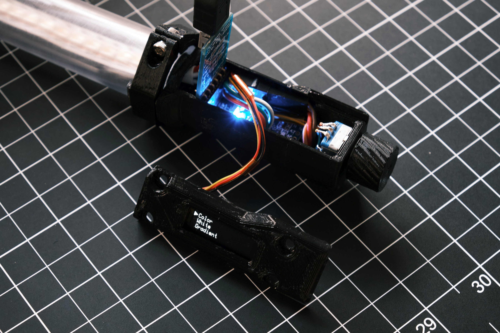
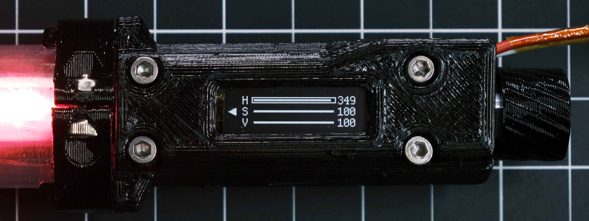

# Glowstick

## Features
* Full onboard control with OLED display and rotary encoder
* Uses a SK6812 LED strip for white and RGB light
* Color, white, and gradient modes for full control over lighting
* Animation modes for light painting
* Powered over USB or any other 5V source
* BOM cost less than US$50 for a 24" long light

## Hardware

### Components used
* Arduino Pro Mini or Pololu A-Star 328PB Micro
* SK6812 RGBW LED strip, 1m length, 144 LED/m IP30
* SSD1306 I2C OLED display breakout board, 128x32 pixels
* EC11 series rotary encoder, push button switch, 15mm knurled shaft (EC11M)
* Clear polycarbonate tube, 1" OD 3/4in ID, 24in length
* M3 hex socket head cap screws, 4x 20mm and 2x 8mm; 6x M3 hex nuts

## Software

[U8g2](https://github.com/olikraus/u8g2) is used for controlling the display and [FastLED](https://github.com/FastLED/FastLED) is used for controlling the LED strips, with some hacks to make it work with RGBW LEDs.

The firmware is built using [PlatformIO](http://docs.platformio.org/en/latest/ide.html#platformio-ide).

## Build your own

### Wiring diagram

### 3D printed parts
STL files for all 3D printed parts and original Solidworks design files can be found in the [GrabCAD folder for this project](https://workbench.grabcad.com/workbench/projects/gcfMel1k3mHmgKFM-v4mYhzHF4UytLH0CcWSUiFCYhUIy2#/space/gcyOI77-vFgamuT2R-LxKiL_oJ_SbqqWW22Kso9QQ5grLW). All parts should be printed at 100% infill. Supports are required for `20-stick-p001 electronics enclosure`, `20-stick-p003 electronics enclosure cover`, and `20-stick-p005 encoder knob`. I printed everything in PETG; any material should work but stronger ones are recommended.

### LED strip mounting
Mounting an LED strip inside a small diameter tube is hard. The tube is curved and the LED strip is not, and the strip does not stay flat unless it is supported along its entire length.

My solution to this was to use 3M VHB tape to semi-permanently attach several 3D-printed mounting points inside the tube at regular intervals. The LED strip is then attached to these mounting points using 3M Dual Lock allowing it to be easily removed and reinstalled later on.

## License
MIT
