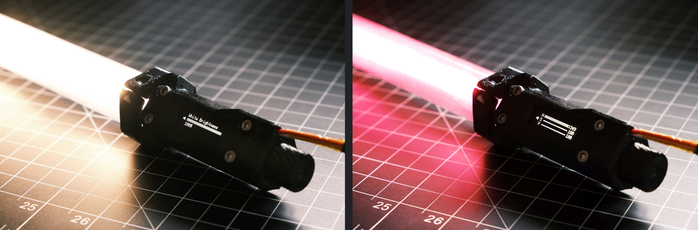
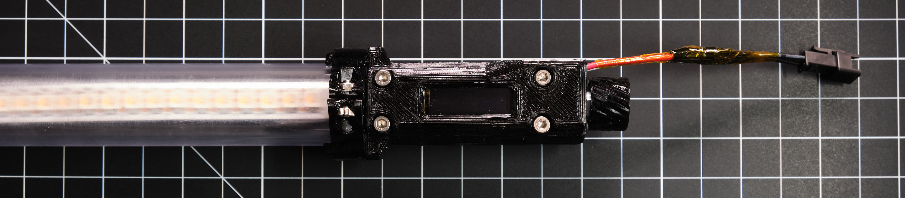

---
---

# Glowstick

## Features
* Full onboard control with OLED display and rotary encoder
* Uses a SK6812 LED strip for white and RGB light
* Color, white, and gradient modes for full control over lighting
* Animation modes for light painting
* Powered over USB or any other 5V source
* BOM cost less than US$50 for a 24" long light

## Hardware

#### more coming soon...

## Software

#### more coming soon...

## License
MIT
